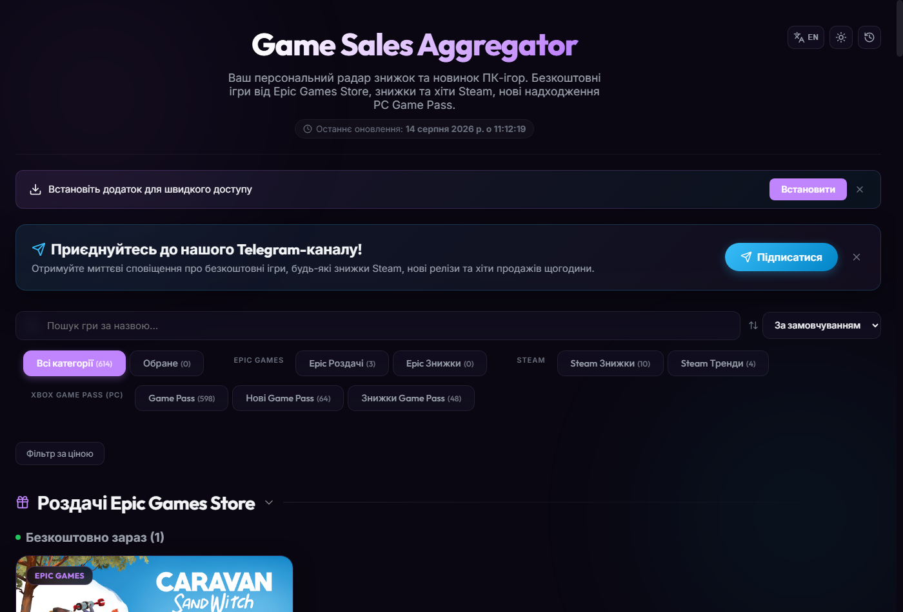
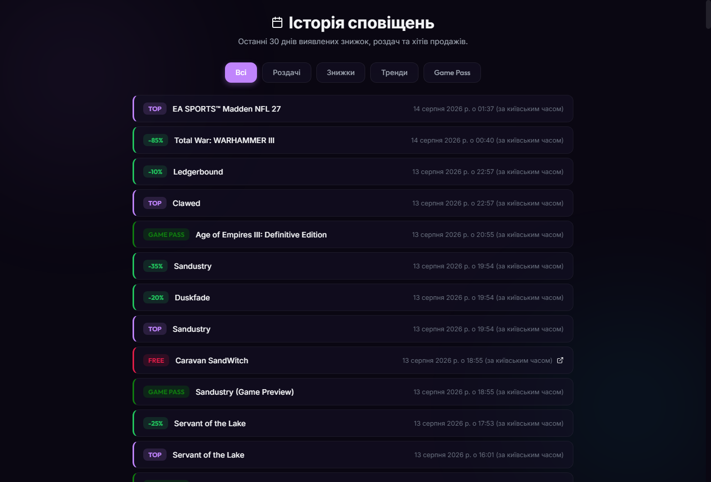

<div align="center">

# Game Sales Aggregator — Source Code

[](https://github.com/ajjs1ajjs/Sales)
[](https://ajjs1ajjs.github.io/Sales/)
[](LICENSE)
[](https://github.com/ajjs1ajjs/Sales/actions/workflows/scheduler.yml)

> **Це репозиторій з вихідним кодом Sales gaming deals tracker.**
> Готовий продукт деплоїться в: **https://github.com/ajjs1ajjs/Sales**
> Офіційний сайт: **https://ajjs1ajjs.github.io/Sales/**


# 🎮 Game Sales Aggregator

**Персональний радар знижок та безкоштовних ігор** — автоматично збирає актуальні пропозиції з **Steam**, **Epic Games Store** та **Xbox Game Pass (PC)** і публікує їх на сайті та у Telegram-каналі.

[](https://ajjs1ajjs.github.io/Sales/)
[](https://t.me/salesgamesua)
[](https://github.com/ajjs1ajjs/Sales/releases)
[](https://github.com/ajjs1ajjs/Sales/actions/workflows/scheduler.yml)

[**🌐 Live Site**](https://ajjs1ajjs.github.io/Sales/) · [Releases](https://github.com/ajjs1ajjs/Sales/releases) · [Actions](https://github.com/ajjs1ajjs/Sales/actions)

</div>
---

## 🖼️ Screenshots

| Головна сторінка | Історія сповіщень |
|---|---|
|  |  |

## 📡 Що відстежується

| Платформа | Тип | Опис |
|-----------|-----|-------|
| **Epic Games** | Безкоштовні роздачі | Ігри, які зараз безкоштовні |
| **Epic Games** | Майбутні роздачі | Ігри, що стануть безкоштовними невдовзі |
| **Epic Games** | Знижки | Акційні пропозиції в Epic Games Store |
| **Steam** | Безкоштовні пропозиції | Ігри, які тимчасово можна отримати безкоштовно |
| **Steam** | Гарячі знижки | Акційні пропозиції від 5% |
| **Xbox Game Pass PC** | Нові надходження | Ігри, щойно додані до PC Game Pass |

## ✨ Можливості сайту

| | |
|---|---|
| 🔍 **Пошук** | за назвою гри, з debounce 300 мс |
| 🗂️ **Фільтрація** | за категоріями (Epic/Steam, безкоштовні/знижки, нові ігри Game Pass) |
| ↕️ **Сортування** | за ціною, відсотком знижки або назвою |
| 💰 **Фільтр ціни** | вибір діапазону цін |
| ⭐ **Список бажань** | обрані ігри, зберігаються в localStorage |
| 🕘 **Історія сповіщень** | виявлені знижки/роздачі/додавання за останні 30 днів |
| 🌗 **Теми** | темна/світла, перемикання одним кліком |
| 📱 **PWA** | встановлюється як додаток на телефон/ПК |
| 📴 **Офлайн-режим** | кешування через Service Worker |
| 🌐 **Двомовність** | українська та англійська (перемикання в хедері) |
| 🔎 **SEO** | Open Graph, Twitter Cards, JSON-LD, sitemap.xml |

## ⚙️ Як це працює

```
Кожну годину (24/7)
        │
        ▼
GitHub Actions запускає скрипт
        │
        ▼
Збираються дані з API Steam, Epic Games та Xbox Game Pass
        │
        ├──▶ Оновлюється deals.json у репозиторії
        │
        ├──▶ Генерується sitemap.xml
        │
        ├──▶ Будується React-додаток → GitHub Pages (сайт)
        │
        └──▶ Нові знижки/роздачі/додавання → Telegram-канал
```

## 🚀 Локальний запуск

**Вимоги:** Node.js 20+ · npm

**Автоматичне встановлення** (сам ставить Node.js, залежності, дані та білд):
```bash
# Ubuntu / Debian
curl -fsSL https://raw.githubusercontent.com/ajjs1ajjs/Sales/main/scripts/install.sh | bash
# або режим dev-сервера:
bash scripts/install.sh --dev
```

```powershell
# Windows (PowerShell)
irm https://raw.githubusercontent.com/ajjs1ajjs/Sales/main/scripts/install.ps1 | iex
# або режим dev-сервера:
powershell -ExecutionPolicy Bypass -File scripts\install.ps1 -Dev
```

**Вручну:**

```bash
git clone https://github.com/ajjs1ajjs/Sales.git
cd Sales
npm install

npm run fetch   # отримати актуальні дані
npm run dev     # запустити сайт локально
npm run build   # продакшн-білд
npm run lint    # лінтер
npm test        # тести
```

> **Цільове середовище CI/деплою:** збірка, тести та деплой у GitHub Actions працюють на `ubuntu-latest`. Локальна розробка та встановлення підтримуються і на **Ubuntu / Debian** (`scripts/install.sh`), і на **Windows** (`scripts/install.ps1`). Застосунок статичний (PWA), для розгортання `dist/` достатньо будь-якого веб-сервера (nginx, Caddy тощо).

## 🔑 Налаштування GitHub Actions

Для повноцінної роботи додайте **секрети** у `Settings → Secrets and variables → Actions`:

| Секрет | Опис |
|--------|------|
| `TELEGRAM_BOT_TOKEN` | Токен бота від @BotFather |
| `TELEGRAM_CHAT_ID` | ID вашого Telegram-каналу |

**Отримання Chat ID каналу:**
1. Додайте бота як адміністратора каналу
2. Надішліть повідомлення в канал
3. Відкрийте: `https://api.telegram.org/bot<TOKEN>/getUpdates`
4. Знайдіть поле `"chat": {"id": ...}`

## 🧩 Технології

- **Frontend:** React 19 + TypeScript + Vite + React Router
- **Стилі:** Vanilla CSS з Glassmorphism-ефектами, темна/світла теми
- **Локалізація:** власна i18n (LocaleContext) — українська та англійська
- **Збір даних:** Node.js + TypeScript (tsx)
- **Автоматизація:** GitHub Actions (cron щогодини)
- **Хостинг:** GitHub Pages
- **Сповіщення:** Telegram Bot API
- **PWA:** vite-plugin-pwa + Service Worker

## 📁 Структура

```
Sales/
├── .github/workflows/scheduler.yml   # запуск щогодини
├── public/data/deals.json            # актуальні дані про знижки
├── scripts/
│   ├── fetch-deals.ts                # збір даних з API
│   └── generate-sitemap.ts           # генерація sitemap.xml
├── src/
│   ├── components/                   # GameCard, Epic/Steam/XboxSection та ін.
│   ├── contexts/                     # LocaleContext, WishlistContext
│   ├── hooks/                        # useDebounce, useInstallPWA, useLocalStorage
│   ├── locales/                      # uk.ts, en.ts
│   ├── App.tsx                       # роутер
│   ├── DataContext.tsx               # завантаження deals.json
│   └── sw.ts                         # Service Worker
└── vite.config.ts                    # Vite + PWA
```

## 📢 Telegram-канал

Підписуйтесь на [@salesgamesua](https://t.me/salesgamesua) — миттєві сповіщення про:
- Безкоштовні ігри від Epic Games
- Знижки в Epic Games Store
- Гарячі знижки у Steam (від 5%)
- Нові ігри в PC Game Pass
- Очікувані додавання до Game Pass

---

<div align="center">

Розроблено для геймерів з ❤️

</div>
