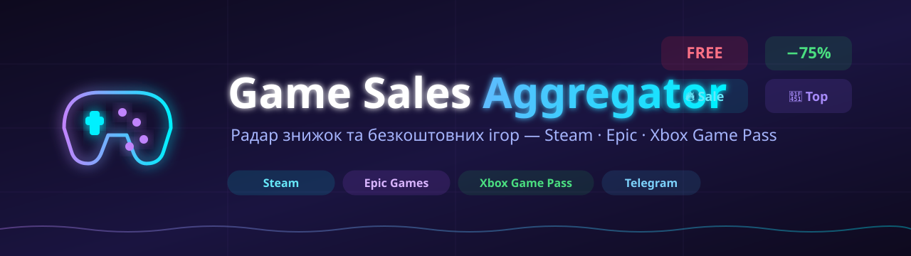
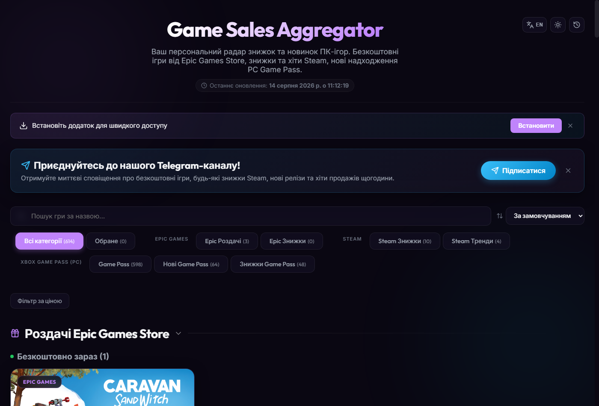
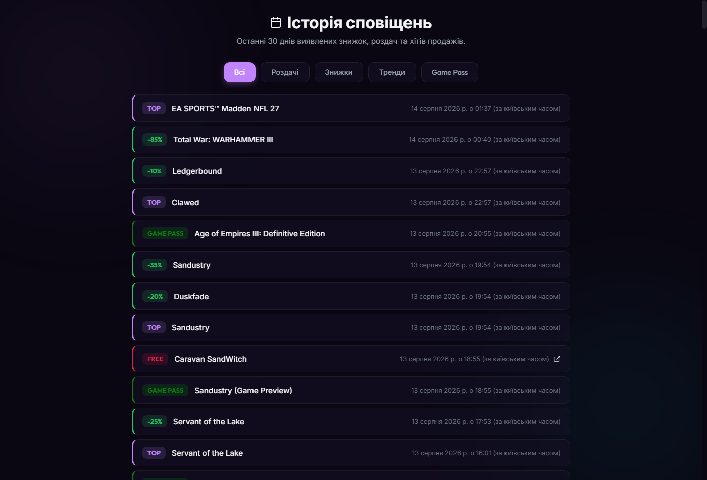

<div align="center">

# Game Sales Aggregator — Source Code

[](https://ajjs1ajjs.github.io/dist/sales/)

> **Це приватний репозиторій з вихідним кодом Sales gaming deals tracker.**
> Готовий сайт хоститься з публічного репозиторію артефактів:
> **https://ajjs1ajjs.github.io/dist/sales/**



# 🎮 Game Sales Aggregator

**Персональний радар знижок та безкоштовних ігор** — автоматично збирає актуальні пропозиції **Steam** (знижки, безкоштовне, топи продажів) і публікує їх на сайті та у Telegram-каналі.

[](https://ajjs1ajjs.github.io/dist/sales/)
[](https://t.me/salesgamesua)

[**🌐 Live Site**](https://ajjs1ajjs.github.io/dist/sales/)

</div>
---

## 🖼️ Screenshots

| Головна сторінка | Історія сповіщень |
|---|---|
|  |  |

## 📡 Що відстежується

| Платформа | Тип | Опис |
|-----------|-----|-------|
| **Steam** | Безкоштовні пропозиції | Ігри, які тимчасово можна отримати безкоштовно |
| **Steam** | Гарячі знижки | Акційні пропозиції від 5% (specials + топи продажів) |
| **Steam** | Тренди | Top Sellers — хіти продажів прямо зараз |

## ✨ Можливості сайту

| | |
|---|---|
| 🔍 **Пошук** | за назвою гри, з debounce 300 мс |
| 🗂️ **Фільтрація** | за категоріями (Steam: безкоштовні/знижки/тренди) |
| ↕️ **Сортування** | за ціною, відсотком знижки або назвою |
| 💰 **Фільтр ціни** | вибір діапазону цін |
| ⭐ **Список бажань** | обрані ігри, зберігаються в localStorage |
| 🕘 **Історія сповіщень** | виявлені знижки/роздачі/додавання за останні 30 днів |
| 🌗 **Теми** | темна/світла, перемикання одним кліком |
| 📱 **PWA** | встановлюється як додаток на телефон/ПК |
| 📴 **Офлайн-режим** | кешування через Service Worker |
| 🌐 **Двомовність** | українська та англійська (перемикання в хедері) |
| 🔎 **SEO** | Open Graph, Twitter Cards, JSON-LD, sitemap.xml |

## ⚙️ Як це працює

```
Дані (щогодини, у публічному репо ajjs1ajjs/dist):
        scheduler → Steam API (categories + search topsellers) → sales/data/deals.json + Telegram
        │
        ▼
Цей репозиторій (вихідний код, приватний):
        push у main / щодня за розкладом → Release (lint, тести, build)
        │
        └──▶ Збірка PWA → ajjs1ajjs/dist/sales (GitHub Pages)
```

> Збірка й деплой виконуються у GitHub Actions цього репозиторію
> (`.github/workflows/release.yml`): на кожен push у `main`, щодня за
> розкладом (`05:17 UTC`) та вручну. Якщо збірка ідентична опублікованій,
> версія не підвищується й тег не створюється. Актуальні дані про знижки
> (`sales/data/deals.json`) оновлює scheduler у публічному репо `ajjs1ajjs/dist`,
> тому сайт завжди показує свіжі пропозиції без перезбірки застосунку.

## 🚀 Локальний запуск

**Вимоги:** Node.js 20+ · npm

**Автоматичне встановлення** (сам ставить Node.js, залежності, дані та білд):
```bash
# Ubuntu
curl -fsSL https://raw.githubusercontent.com/ajjs1ajjs/Sales/main/scripts/install.sh | bash
# або режим dev-сервера:
bash scripts/install.sh --dev
```

**Вручну:**

```bash
git clone https://github.com/ajjs1ajjs/Sales.git
cd Sales
npm install

npm run fetch   # отримати актуальні дані
npm run dev     # запустити сайт локально
npm run build   # продакшн-білд
npm run lint    # лінтер
npm test        # тести
```

> **Цільове середовище CI/деплою:** збірка, тести та деплой у GitHub Actions працюють на `ubuntu-latest`. Локальна розробка та встановлення підтримуються лише на **Ubuntu** (`scripts/install.sh`). Застосунок статичний (PWA), для розгортання `dist/` достатньо будь-якого веб-сервера (nginx, Caddy тощо).

## 🔑 Налаштування GitHub Actions

Для повноцінної роботи додайте **секрети** у `Settings → Secrets and variables → Actions`:

| Секрет | Обов'язковий | Опис |
|--------|--------------|------|
| `PUBLIC_RELEASE_TOKEN` | так (деплой) | Personal Access Token з правом `repo` на публічний репозиторій `ajjs1ajjs/dist` — потрібен `release.yml` для публікації збірки й реліз-тегів |
| `TELEGRAM_BOT_TOKEN` | ні (дані/сповіщення) | Токен бота від @BotFather — використовується scheduler-ом для сповіщень |
| `TELEGRAM_CHAT_ID` | ні (дані/сповіщення) | ID вашого Telegram-каналу |

**Отримання Chat ID каналу:**
1. Додайте бота як адміністратора каналу
2. Надішліть повідомлення в канал
3. Відкрийте: `https://api.telegram.org/bot<TOKEN>/getUpdates`
4. Знайдіть поле `"chat": {"id": ...}`

## 🧩 Технології

- **Frontend:** React 19 + TypeScript + Vite + React Router
- **Стилі:** Vanilla CSS з Glassmorphism-ефектами, темна/світла теми
- **Локалізація:** власна i18n (LocaleContext) — українська та англійська
- **Збір даних:** Node.js + TypeScript (tsx)
- **Автоматизація:** GitHub Actions (cron щогодини)
- **Хостинг:** GitHub Pages
- **Сповіщення:** Telegram Bot API
- **PWA:** vite-plugin-pwa + Service Worker

## 📁 Структура

```
Sales/
├── .github/workflows/ci.yml          # build + лінт + тести
├── .github/workflows/release.yml     # збірка сайту → ajjs1ajjs/dist/sales
├── public/data/deals.json            # актуальні дані про знижки
├── scripts/
│   ├── fetch-deals.ts                # збір даних з API
│   └── generate-sitemap.ts           # генерація sitemap.xml
├── src/
│   ├── components/                   # GameCard, SteamSection та ін.
│   ├── contexts/                     # LocaleContext, WishlistContext
│   ├── hooks/                        # useDebounce, useInstallPWA, useLocalStorage
│   ├── locales/                      # uk.ts, en.ts
│   ├── App.tsx                       # роутер
│   ├── DataContext.tsx               # завантаження deals.json
│   └── sw.ts                         # Service Worker
└── vite.config.ts                    # Vite + PWA
```

## 📢 Telegram-канал

Підписуйтесь на [@salesgamesua](https://t.me/salesgamesua) — миттєві сповіщення про:
- Безкоштовні пропозиції у Steam
- Гарячі знижки у Steam (від 5%)

---

<div align="center">

Розроблено для геймерів з ❤️

</div>
